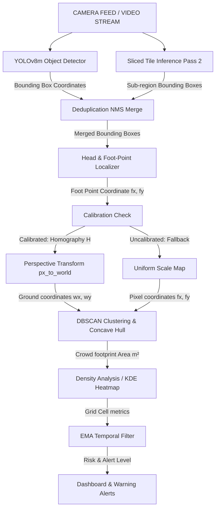

# 👁️‍🗨️ Advanced Crowd Monitoring System


An enterprise-grade crowd monitoring and analytics system that provides **perspective-correct density estimation**, **real-time ground-plane calibration**, **sliced tile inference**, and **localized congestion alerts** under various camera perspective angles.

---

## 🏗️ System Architecture

The following flowchart outlines the processing pipeline of each video frame:



---

## 🧠 Methodology & Core Pipelines

The system is designed to provide high precision in crowd counting and density metrics using five advanced processing layers:

### 1. Sliced Tile Inference (CPU vs GPU Optimized)
Angled camera views suffer from perspective foreshortening: people close to the camera appear large, while people at the far end of the scene appear tiny (often only 20-50 pixels tall). A standard object detector run on the full frame frequently misses these far-away individuals.
- **Pass 1 (Full Frame)**: Runs `model.track()` at `1280`px resolution to track individuals across frames.
- **Pass 2 (Tiled Slices)**: Divides the frame into overlapping sub-regions (tiles of size `640` or `480`px) and runs YOLO on each tile. Tiny, distant individuals are effectively zoomed-in, boosting recall.
- **Merging & NMS**: Detections from both passes are merged using Intersection-over-Union (IoU) filtering to prevent duplicates.
- **Hardware Adaptability**: Sliced tile inference is computationally heavy. The system automatically detects CUDA support:
  - **GPU**: Uses `yolov8m.pt` at `1280`px resolution + full tile slicing (`640`px).
  - **CPU**: Falls back to `yolov8s.pt` (4x faster) at `960`px resolution + optimized tile size (`480`px) to prevent UI lag.

### 2. Foot-Point Ground Localization
Common detectors map objects using bounding box centers (`cx, cy`). For angled cameras, the center of a person's bounding box floats in mid-air and visually overlaps with background objects, such as buildings, walls, or sky.
- **Ground contact mapping**: The system uses `HeadLocalizer` to isolate the **foot point** (`fx, fy`) of each bounding box (where the person's feet contact the floor).
- **No Building Hotspots**: By calculating grid cells and KDE heatmaps exclusively from foot points, density is mapped directly on the ground plane, preventing background buildings from falsely lighting up as crowding hotspots.

### 3. Perspective-Correct Homography
Traditional monitoring counts pixels and applies a uniform multiplier. In real deployments, a single `CELL_AREA_M2` constant overcounts density near the camera and undercounts it far away.
- **Homography Matrix $H$**: A 3x3 transformation matrix maps pixel coordinates $(u, v)$ to real-world ground coordinates $(x, y)$ in meters.
- **Individual Cell Areas**: The system precomputes the physical area of each grid cell using the Shoelace formula on the projected vertices.
- **Concave Hull Area**: Crowd footprint is computed by building an Alpha Shape (concave hull) around DBSCAN-clustered foot points in physical meters, ignoring unused space.

### 4. Interactive Calibration Wizard
Because crowds do not contain recognizable patterns (like checkerboards or regular tile grids), fully-automatic computer vision calibration often fails.
- **Startup Wizard**: On startup, the system opens an interactive OpenCV GUI.
- **Point Selection**: The user clicks the 4 corners of the floor region in order:
  1. Top-Left $\rightarrow$ 2. Top-Right $\rightarrow$ 3. Bottom-Right $\rightarrow$ 4. Bottom-Left
- **Visual Guides**: Interactive color-coded markers, connecting lines, and a live crosshair guide the process.
- **Controls**: Press `Z` to undo, `R` to reset, `ENTER` to confirm, or `S` / `ESC` to skip and load the last saved configuration.

---

## 💻 Tech Stack & Dependencies

- **Framework**: Python 3.8+
- **Deep Learning**: PyTorch, Ultralytics YOLOv8
- **Image Processing**: OpenCV (Open Source Computer Vision Library)
- **Math & Spatial Analysis**: NumPy, Scikit-learn (DBSCAN), Alphashape, Shapely
- **Visualization**: OpenCV high-performance UI overlays

---

## 🚀 Installation & Running

### 1. Install dependencies
```bash
pip install -r requirements.txt
```

### 2. Configure Monitored Dimensions
Edit `config.py` to match the physical width and depth of the ground plane in meters:
```python
WORLD_GRID_W     = 10.0      # meters (floor width)
WORLD_GRID_H     = 8.0       # meters (floor depth)
```

### 3. Run the System
```bash
python main.py
```
- **On Startup**: The manual calibration window will appear. Click the 4 corners of the floor and press `ENTER` to calibrate, or press `S` to skip and use the previous calibration.
- **During Monitoring**:
  - Press `C` to open the runtime calibration menu (recalibrate or validate).
  - Press `Q` to exit.
