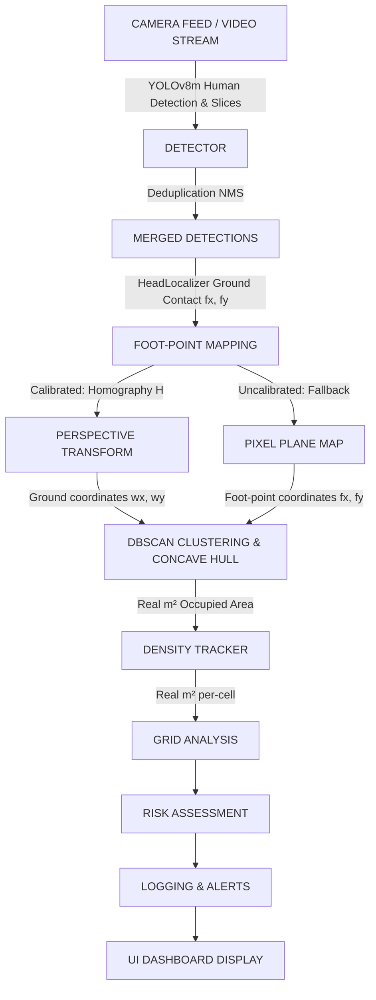

# Ground Plane Calibration — Technical Architecture

## System Overview



---

## Module Breakdown

### 1. `calibration.py` — Homography Engine

**Core Responsibilities:**
- Guided manual 4-point calibration UI with live overlays
- Homography matrix computation
- Pixel $\leftrightarrow$ World coordinate transforms
- Per-cell real area calculation using Shoelace formula
- Validation & quality metrics (condition number, determinant, reprojection error)

**Key Functions:**

```python
# CALIBRATION WORKFLOW
_manual_point_selection(frame)      # Interactive 4-point selection with undo/reset
run_calibration(frame)              # Shared frame wrapper for auto/manual calibration
validate_calibration(frame)         # Show grid overlay & confirm
recalibrate_interactive()           # Runtime recalibration confirm dialog

# COORDINATE TRANSFORMS
px_to_world(pixel_pts)              # N×2 pixels → N×2 metres (uses H)
world_to_px(world_pts)              # N×2 metres → N×2 pixels (uses H_inv)
world_to_grid(wx, wy)               # World → (row, col) indices
cell_area_m2(row, col)              # Real floor area of cell (row, col)

# STATE variables
_H                                  # 3×3 homography matrix
_H_inv                              # Inverse matrix for drawing world coordinate grids
_cell_areas[ROWS][COLS]             # Pre-computed cell areas in square meters
```

**Calibration Storage:**

```
homography.npy
├─ Shape: (3, 3)
├─ Type: float64
├─ Content: 3×3 homography matrix H
└─ Use: Loaded at startup, written upon confirmation
```

---

### 2. `detector.py` — Multi-Pass Detection with Ground Contact Mapping [UPDATED]

**Core Responsibilities:**
- Run YOLOv8m/yolov8s tracking on the full frame.
- Sliced Tile Inference (Pass 2) to catch small, distant people.
- Map people to their ground contact coordinates (Foot-Points) instead of box centroids.
- Compute overlap ratio for occlusion correction.

**Key Components & Operations:**

- **Pass 1: Full-Frame Tracking**: Runs tracking at high resolution (`_INFER_SIZE`).
- **Pass 2: Sliced Tiles**: Overlapping sub-sections of the frame are extracted at runtime and passed through the detector. Detections are translated back to full-frame coordinates.
- **NMS Merge**: Bounding boxes from both passes are merged. If a tile detection heavily overlaps with an existing tracked box, it is discarded to prevent double-counting.
- **Foot-Point ground mapping**: Uses `HeadLocalizer` to find the exact point where a person stands on the floor:
  $$fx = \frac{x_1 + x_2}{2}, \quad fy = y_2 - 0.05 \times (y_2 - y_1)$$
- **Grid Assignment Fix**: Grid cells are calculated based on `fx, fy` (ground contact points) rather than `cx, cy` (centroids), preventing distant people from registering inside cell grids mapped to buildings/sky.

---

### 3. `density.py` — Perspective-Corrected Density & Spatial Analysis [UPDATED]

**Core Responsibilities:**
- Compute DBSCAN clustering and Concave Hull (Alpha Shape) footprint of the crowd.
- Calculate real-world area in $m^2$.
- Per-cell density using perspective-corrected grid cell areas.
- Generate normalized Kernel Density Estimation (KDE) maps.

**Implementation Highlights:**

- **Ground Contact Hull**: Clustering and hulls are built using foot-points (`fx, fy` or `wx, wy`) to ensure the crowd boundaries sit flat on the ground plane, preventing buildings or vertical structures from falsely expanding the crowd footprint.
- **KDE Heatmap**: Evaluated across both calibrated (using world metrics) and uncalibrated modes (using normalized foot-points), keeping hotspots anchored to where people stand.
- **Dynamic Cell Areas**:
  ```python
  for row, col in grid:
      cell_area = calibration.cell_area_m2(row, col)
      # Far-field cells: smaller in pixels, larger in physical reality.
      # Near-field cells: larger in pixels, smaller in physical reality.
  ```

---

### 4. `main.py` — Orchestrator & Execution Loop [UPDATED]

**Core Responsibilities:**
- Run startup sequence checks.
- Open the calibration GUI on startup.
- Run the frame loop, render overlays, and handle keyboard interrupts.

**Key Flows:**
- **Calibration Check**: If `homography.npy` is missing, opens the manual calibration UI. Users can also trigger manual calibration on every startup to refine points. Pressing `S`/`ESC` skips to fallback or loads the last saved config.
- **Interactive Recalibration**: Pressing `C` pauses monitoring, bringing up a validation and recalibration wizard.

---

## Technical Transformation Math

### Homography Matrix ($H$)
Maps points on the image plane to the floor plane:
$$\begin{bmatrix} x_{world} \\ y_{world} \\ 1 \end{bmatrix} \sim H \begin{bmatrix} u_{pixel} \\ v_{pixel} \\ 1 \end{bmatrix}$$
Where $H$ is computed from 4 clicked point pairs mapping to `WORLD_GRID_W` and `WORLD_GRID_H` dimensions.

### Area Integration
The concave hull area in world space is computed directly using:
$$\text{Area} = \frac{1}{2} \left| \sum_{i=0}^{N-1} (x_i y_{i+1} - x_{i+1} y_i) \right|$$
Where $(x_i, y_i)$ are the vertices of the polygon in meters. This avoids perspective scale errors.

---

## Configuration Dependencies

```
config.py
├── CAMERA_INDEX           → YOLO input & frame capture source
├── WORLD_GRID_W/H         → Ground dimensions in meters
├── CELL_AREA_M2           → Fallback uniform grid cell area
├── DEVICE                 → Hardware (CPU vs CUDA GPU)
├── CONF_THRESHOLD         → Detection confidence floor
└── OCCLUSION_GAIN         → Crowd occlusion scaling coefficient
```

**Architecture Version:** 2.1  
**Last Updated:** June 2026
